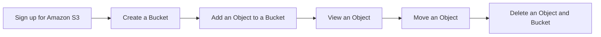

# AWS

## S3

Amazon Simple Storage Service는 인터넷 상에 있는 스토리지. 이를 사용하면 웹을 통해 언제 어디서든 원하는 양의 데이터를 저장하고 검색할 수 있다. AWS Management 콘솔을 사용하여 이러한 작업을 수행할 수 있다.

## EC2

PM2 : 터미널을 꺼도 계속 서버가 돌아가게 하는 모듈

Pm2 start -> list로 확인

## RDS
